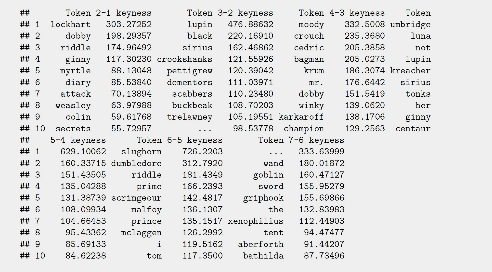

# Executive Summary

\textbf{Introduction:} This paper revolves around a character relationship and sentiment analysis performed on the Harry Potter corpus consisting of the seven novels. We address three research questions that provide us with tangible insights into these areas.

\textbf{Data}: Most of the data used was pretty well-organized and structured which required some basic pre-processing to get it ready for analysis. We used seven `txt` text files containing raw text for each of the seven Harry Potter novels in addition to the `harrypotter` package in R that contained the same data sorted by chapters for each of the novels.

\textbf{Methods}: The main text analysis methods employed were: (i) keyness analysis using log-likelihood values, (ii) collocational analysis using mutual information, and (iii) `analyzeSentiment` function found within the `SentimentAnalysis` package in R to do sentiment analysis.

\textbf{Results}: We find some characters that have high keyness value either occur in the series for the first time in the target novel or occur at a frequency greater than expected. As for the strength of relationship of different characters with Harry, we find that Ron and Hermione consistently have the higher scores in addition to some interesting trends observed in the patters for other characters. Upon performing sentiment analysis on the entire series, we find that almost every novel contains a roughly even spread of chapters being characterized with a positive or a negative score and the overall sentiment trend increases and then decreases.

\textbf{Discussion}: Most of our results corroborate with the events and story line of the books. While some of these findings may be straightforward to someone who has read the books before, they can be particularly useful for someone who hasn’t read the novels or doesn’t remember the story line very well. The main limitation of this analysis is that it adopts a one-dimensional approach to analyzing the books using the various statistical methods which could present a limited perspective without taking into account the context of the story.

# Introduction

## Research Questions

For this assignment, we will be working with the Harry Potter corpus that contains seven documents, each for the seven books written by author J.K. Rowling. Our study focuses on four research questions:

\begin{enumerate}
  \item Do certain characters appear more frequently in some books than the other?
  \item How does the relationship of some key characters evolve with Harry Potter across the books?
  \item What is the general sentiment trend as the story evolves?
\end{enumerate}

## Motivation

The motivation behind the different research questions is as follows:

\begin{enumerate}
  \item It would be interesting to know which character(s) the author, JK Rowling, is trying to emphasis. This would be useful in determining if the character becomes more important in the next book or just shows up once for making a fuller story.
  \item Friendships and relationships are major themes of the series, and this analysis will allow us to see who has been key to Harry's growth as a protagonist at different points in the story
  \item This will enable us to quantify how the overall sentiment has progressed with the unfolding of different events
\end{enumerate}

Answering these research questions will provide us an insight into different aspects of the story and trends that might not have been very apparent otherwise.

# Data

The data set used for this analysis includes seven `txt` text files that contain the raw text for each of the seven Harry Potter novels written by JK Rowling. Combined, the seven text files contain about $1.4$ million words and $35,000$ sentences.

The data is then loaded into R and processed using the `quanteda` package to create a `token` object which will then be used for our main analysis. The data pre-processing process had the following steps:

+ Reading the `txt` filed using the `readtext()` function

+ Converting them into corpus objects using the `corpus()` function

+ Tokenizing the corpora with parameters `remove_punct = TRUE`, `remove_numbers = TRUE`, `remove_symbols = TRUE`, and `what = "word"`

+ Converting all the tokens into lowercase using `tolower()` function

+ Compounding multiword expressions

For some of the research questions, we also use the `harrypotter` package in R, which contains texts for all the seven novels sorted into different chapters. The data used in this report is pretty structued, clean, and organized for the most part and it took minimal wrangling effort on the researchers' part.

# Statistical Methods

## Research Question 1

Keyness analysis is a good way to compare observed and expected frequencies. The first book, Sorcerer's Stone will be the reference corpus used to compare with the second book, Chamber of Secrets. Similarly, the last book will be the reference corpus used to compare with the next book. The reason we compare two consecutive books is because there might be some characters that don't show up at the beginning, and some characters die or disappear after certain books.

As the first step, we tokenize all text and create a document-feature matrix (DFM). After we get the DFM, we use it to create a keyness table using log-likelihood (LL) values (also know as a G2 or goodness-of-fit test) as the preferred keyness metric. Larger the LL value of a token, greater is the difference between the target and the reference corpora.

## Research Question 2

The first step in order to assess how a character's relationship with Harry Potter has changed is to compute a "relationship score" of some sort at each discrete step, that is, a quantitative estimate that can give us an idea of the strength of the relationship in a particular book. As the next step, we can compute this value across all books and assess and trends or changes. This process is then repeated for all the characters we wish to assess Harry's relationship with.

We obtain the value of this "relationship score" by computing the \textbf{mutual information} between Harry and other characters we wish to compare his relationship with, that will be Albus Dumbledore, the Hogwarts Headmaster; Ginny Weasley, sister of Ron Weasley and Harry's wife; Hermoine Granger, one of Harry's best friends at Hogwarts; Draco Malfoy, Harry's classmate and a close villian; Ron Weasley, one of Harry's best friends at Hogwarts; Severus Snape, one of Harry's teachers at Hogwarts that has a complex relationship with Harry and his mother. This has been accomplished by leveraging the capabilities of the `quanteda` package to perform collocational analysis using mutual information between relevant tokens in the novels.

The reason collocates by mutual information (MI) was picked as the criteria to do our selection of relationship scores is because of its ability to produce collocational measures by pointwise mutual information between specified tokens in a `quanteda tokens` object. What that means is that for a given token, it is able to provide us with a numerical estimate of how much information it contains about another token occurring in the same text. So, for example, if token one has a high MI score for token two, then it means token one conveys significant information about token two whenever it occurs in the text, and vice versa. Such a representation is quite robust in assessing relationships since it enables us to see how much mutual information do tokens of two characters share with each other and we would expect characters having a strong relationship to share more mutual information between their tokens whenever those occur in the text.

We treat these tokens as collocates and compute the MI score between `harry` and each of {`dumbledore`, `ginny`, `hermoine`, `malfoy`, `ron`, `snape`} for each of the seven books using function `collocates_by_MI()`. After computing these values, we plot a line graph with the relationship scores aka MI scores on the vertical axis and the books on the horizontal axis. There are seven line graphs plotted, as shown in Figure 1, one for each character, that give us a visual representation of the evolution of each character's relationship with Harry Potter across all the books.

## Research Question 3

We performed sentiment analysis on each chapter in the series using the `SentimentAnalysis` package. We first found the an average sentiment score for each chapter from every novel using the `harrypotter` package in R using the `analyzeSentiment` function. The `SentimentGI` value is taken as the average sentiment score for each chapter in a particular novel. A `SentimentGI` score greater than $0$ implies a positive sentiment, and a `SentimentGI` score less than $0$ implies a negative sentiment.

Next, we prepared a data frame object consisting of sentiment scores for each of the $200$ chapters across the seven books in the series and using that, plotted a scatterplot and a smooth fit to visualize the general sentiment trend as the novels progress.

# Results

Overall, we get satisfactory results and observations from our analysis. There do not seem to be any anomalies and the data is easily interpretable.

## Research Question 1

A larger keyness value means that the character appears more frequently in the current book (target corpus) than in the previous book (reference corpus). For example, we can see when we take the first book, Sorcerer's Stone, as our reference corpus, and the second book, Chamber of Secrets, as our target corpus, `lockhart` has a high keyness value of $303$, implying that Gilderoy Lockhart shows up more in the second book compared with the first book, or that his first appearance may occur in the second book to begin with. This is indeed true because Gilderoy Lockhart does show up in Chamber of Secrets for the first time.

Based on the different keyness tables, the characters with high keyness values are listed below. The bolded characters show up more than once.

\begin{itemize}
  \item \textbf{Target Corpus: Chamber of Secrets, Reference Corpus: Sorcerer's Stone}: Gilderoy Lockhart, Dobby, Riddle (Lord Voldemort), Ginny Weasley, Moaning Myrtle
  \item \textbf{Target Corpus: Prisoner of Azkaban, Reference Corpus: Chamber of Secrets}: Remus Lupin, Sirius Black, Crookshanks (cat), Peter Pettigrew, Dementor
  \item \textbf{Target Corpus: Goblet of Fire, Reference Corpus: Prisoner of Azkaban}: Alastor Moody, Bartemius Crouch Sr., Cedric Diggory, Ludovic Bagman, \textbf{Dobby}
  \item \textbf{Target Corpus: Order of the Phoenix, Reference Corpus: Goblet of Fire}: Dolores Umbridge, Luna Lovegood, Remus Lupin, Kreacher, \textbf{Sirius Black}, \textbf{Ginny Weasley}
  \item \textbf{Target Corpus: Half Blood Prince, Reference Corpus: Order of the Phoenix}: Horace Slughorn, Albus Dumbledore, \textbf{Riddle (Lord Voldemort)}, Rufus Scrimgeour, \textbf{Draco Malfoy}
  \item \textbf{Target Corpus: Deathly Hallows, Reference Corpus: Half Blood Prince}: Goblin, Griphook, Xenophilius Lovegood, \textbf{Albus Dumbledore}, Bathilda Bagshot
\end{itemize}

{width=80%}

## Research Question 2

From the graph in Figure 1, we see the following:

\begin{enumerate}
  \item No character has had a monotonic trend in their relationship with Harry Potter; each of them exhibits an upward and downward trend across books.
  \item Ron and Hermoine's graphs are above everyone else's, suggesting that they have a stronger relationship with Harry than everyone else across all the books.
  \item Ginny's graph doesn't start until the second book; that is because it was when she was first introduced.
  \item For the books Half Blood Prince and Deathly Hallows, Hermione's score is significantly higher than Ron's which stands out because for almost all the previous books, Ron has been the character to have the strongest relationship score with Harry.
  \item Ginny's score takes a sharp from in Goblet of Fire and rises sharply again in Order of the Phoenix; this is consistent with her appearance and importance of roles in those two books.
  \item Albus Dumbledore has a low relationship score with Harry in Order of the Phoenix and highest in Half Blood Prince, which is consistent since he is not very present around Harry in the fifth book and the theme of the sixth book revolves a lot around him.
\end{enumerate}

{width=80%}

## Research Question 3

From the graph in Figure 2, we see the following:

\begin{enumerate}
  \item The net sentiment of the book starts off at a little below the zero level, suggesting that it doesn't have a very positive start which is in line with the first chapter where Harry's difficult living situation with his aunt and uncle is explained.
  \item Till the end of the fifth book, the overall sentiment of the story gradually increases, peaking at the end of the fifth novel, after which it starts to go down.
  \item There seem to be four big outliers across the entire series: three chapters with a very high negative sentiment score and one chapter with a very high positive sentiment score.
  \item Most sentiment scores range between $-0.04$ to $0.06$.
  \item The overall sentiment monotonically decreases over the sixth and seventh books, ending at a value just below zero at the end of the series.
\end{enumerate}

{width=70%}

# Discussion

## Research Question 1

Most characters have high keyness values because it's the first time they appear. However, for character that show up more than once and also have high keyness value, we believe there's an underlying reason to their repeated occurence hinting at some reason that JK Rowling is trying to emphasis. Thus, it would be useful for us to discover those characters' relationships as it may influence the story development.

Interestingly, although Draco Malfoy is one of the main characters, he doesn't show up on the list having a high keyness value until the sixth book, which corroborates with the storyline since the sixth book revolves a lot around his struggles of becoming a Death Eater and mustering up courage to carry out the task assigned to him by Voldemort of killing Dumbledore.

Even through these findings may look straightforward to anyone who has read the book before, they can be particularly useful for someone who hasn't read the Harry Potter novels or doesn't remember the story line very well.

The only limitation of this analysis is that it provides us with a limited perspective of a character's relative occurence using the keyness value but no context as to how that character may influence the story development. The only way to understand that is by referring back to the story and understanding the character's role in context.

For future research, this suggests exploring character relationships around Dobby, Sirius Black, Ginny Weasley, Lord Voldemort, Draco Malfoy and Albus Dumbledore since they are the key characters. Additionally, this analysis can be applied to any fictional novel series as well that includes multiple characters.

## Research Question 2

This graph in Figure 1 does a good job of addressing our initial research question of analyzing the strength of each character's relationship with Harry Potter. Not only does it confirm what we see in the books but also highlights some interesting trends, such as, Hermoine was closer to Harry than Ron for the last two books. This checks out because we see their friendship grow stronger and there were times when Harry had conflicts with Ron.

This analysis does hold a few limitations: firstly, we only consider the MI scores by analyzing specific tokens for the characters. However, in the novels, a character can be referred to by multiple names. For example, Draco Malfoy is referred to as both Malfoy and Draco, and both of those tokens would have different collocational MI scores with Harry. Here, we consider only the token `malfoy` because that is the more commonly used name for the character. The same holds true for Albus Dumbledore, and we use the MI score using the token `dumbledore` since that is what he is usually referred to as. Because of this, our results might be a bit deflated.

Secondly, our analysis fails to consider distinguish sentiment associated with the mutual information between two characters but rather considers the strength on surface level. If Harry has a strongly positive and strongly negative relationship with two characters, they would both be reflected in the form of high MI scores, but there would be no way for us to distinguish the sentiment between those two.

Further analysis of this topic holds potential for development in these two outlined areas. Despite these limitations, our results are pretty insightful since they line up with the evidence we see in story. It will particularly be helpful for someone who is new to the series and might be having a difficult time keeping track of the multiple characters.

## Research Question 3

In addition to quantifying which stages of the story have held significant positive, negative, or neutral sentiment, the graph in Figure 2 is especially helpful in understanding the emotional trajectory over the course of the story. We see there are instances of rising optimism that corroborate with a "feel good" sentiment but they are also followed by instances of decreasing positivity. All in all, Harry Potter as a series encompasses a wide range of emotions.

Looking at the individual scatter points for the seven books, we notice that there is a roughly equal amount of spread of points above and below zero for each book. This implies that the different chapters for each book are about evenly distribution as either positive or negative and that each book contains a variety of chapters with different emotional ranges. We see that there are some outlier points from books Goblet of Fire, Order of the Phoenix, and Half Blood Prince that have data points corresponding to very low sentiment score. These seem to correspond with the events Cedric Diggory dying and Voldemort returning in Goblet of Fire, Sirius Black dying in Order of the Phoenix, and Albus Dumbledore dying in Half Blood Price, all of which were very melancholic.

One limitation of this analysis is that it only considers an average statistic for each chapter's sentiment and dichotomizes it as either positive or negative. In doing so, it fails to consider other possible emotions such as anger, fear, anticipation, excitement, relief, etc. It could be reasonably inferred that the `analyzeSentiment` function treats emotions such as anger and fear as negative, and excitement and relief as positive, however, that is a broad generalization. For ambiguous emotions such as anticipation, we have no idea of how they are being treated.

For future research, it could be insightful to explore the trends of different emotions across the entire series instead of one general trend that averages everything into a single sentiment score.

# References

1. Rafferty, Greg. “Basic NLP on the Texts of Harry Potter: Sentiment Analysis.” Medium, Towards Data Science, 22 May 2019, https://towardsdatascience.com/basic-nlp-on-the-texts-of-harry-potter-sentiment-analysis-1b474b13651d.

2. “Text Mining: Sentiment Analysis.” Text Mining: Sentiment Analysis · UC Business Analytics R Programming Guide, http://uc-r.github.io/sentiment_analysis.

3. Abe Eyman Casey and Jack Welsh. Harry Potter Text Analysis. http://rstudio-pubs-static.s3.amazonaws.com/449570_fbd322569a664a139f38476a835492c1.html.

4. Minoso, Ian. “A Textual Analysis of Harry Potter by an Amateur Data Analyst.” Medium, Medium, 20 July 2016, https://medium.com/@ianminoso/a-textual-analysis-of-harry-potter-by-an-amateur-data-analyst-6f02c09617e0.

5. Farooqui, Zareen. “Harry Potter Text Analysis.” Medium, Becoming a Data Analyst, 24 Mar. 2018, https://medium.com/zareen-farooqui/harry-potter-text-analysis-4d89ffe59d5b.

6. Feuerriegel, Stefan, and Nicolas Proellochs. Sentimentanalysis Vignette. 18 Feb. 2021, https://cran.r-project.org/web/packages/SentimentAnalysis/vignettes/SentimentAnalysis.html#.

7. Robinson, Julia Silge and David. “2 Sentiment Analysis with Tidy Data: Text Mining with R.” 2 Sentiment Analysis with Tidy Data | Text Mining with R, https://www.tidytextmining.com/sentiment.html.

8. RPubs. (n.d.). Retrieved December 12, 2022, https://rpubs.com/Siebelm/Harry_Potter.

9. Shrivastava, S. (2021, December 6). NLP and Sentiment Analysis of Harry Potter series - Shalvi Shrivastava. Medium. https://medium.com/@shalvi.shrivastava14/nlp-and-textual-analysis-of-harry-potter-series-3604bbe4c6fb.